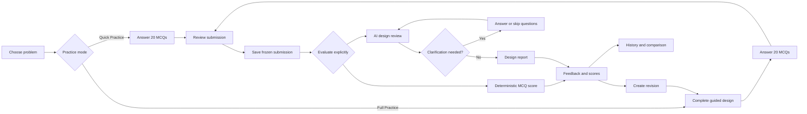
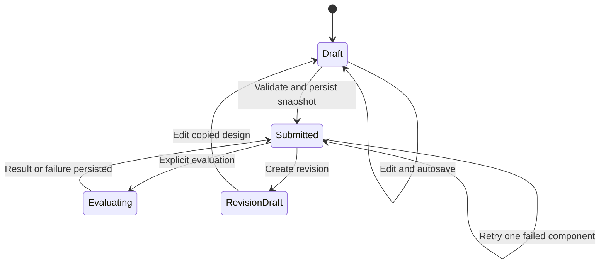
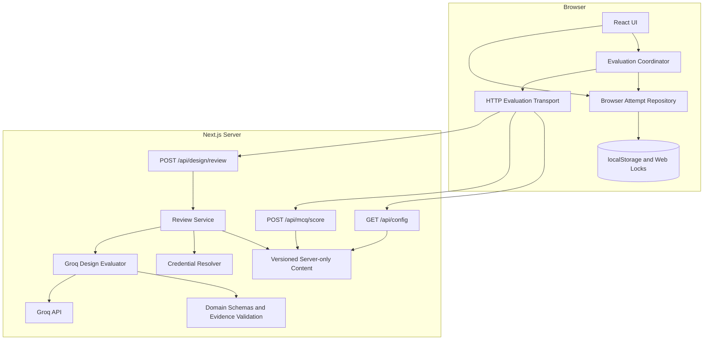

# LLD Practice

LLD Practice is a focused browser-local learning environment for practicing low-level design. It helps a learner move from a problem brief to a structured design, submit a frozen attempt, receive explainable feedback, and revise the design using previous feedback.

The prototype is intentionally small and domain-focused. It is a Next.js monolith with no account system, database, background job service, or external LMS layer.

## Contents

- [What It Does](#what-it-does)
- [Why It Is Useful](#why-it-is-useful)
- [MVP Scope](#mvp-scope)
- [User Flow](#user-flow)
- [Architecture](#architecture)
- [Evaluation Model](#evaluation-model)
- [Data and Failure Handling](#data-and-failure-handling)
- [Getting Started](#getting-started)
- [Using the Application](#using-the-application)
- [Project Structure](#project-structure)
- [Testing and Verification](#testing-and-verification)
- [Documentation](#documentation)
- [Help and Troubleshooting](#help-and-troubleshooting)
- [Maintenance and Contributions](#maintenance-and-contributions)
- [Scope Limitations](#scope-limitations)

## What It Does

The product supports this practice loop:

```text
Choose problem -> Think and design -> Save frozen submission
			-> Evaluate -> Inspect feedback -> Revise -> Compare history
```

The current problem catalogue contains:

- Tic-Tac-Toe
- Snake and Ladder

Each problem has two practice modes:

### Quick Practice

Quick Practice contains 20 multiple-choice questions:

- 10 system-design fundamentals
- 10 problem-specific OOP and code questions
- Java, Python, and C++ variants

Questions cover tracing, defects, responsibility ownership, contracts, and controlled design changes. The answer key is private to the server and scoring is deterministic.

### Full Practice

Full Practice includes the same 20 questions plus a guided design worksheet covering:

- assumptions and scope boundaries
- handling for every trusted requirement
- classes and interfaces
- fields, methods, parameters, and method contracts
- relationships, ownership, dependency direction, and multiplicity
- normal and failure walkthroughs
- one explicit design trade-off

The optional scratchpad is a private thinking aid. It is stored locally but is excluded from AI review and scoring.

## Why It Is Useful

LLD answers are difficult to evaluate with a single canonical diagram. A learner may choose different class names or valid alternative architectures and still satisfy the same requirements. This prototype addresses that problem by:

- asking for behavior and ownership, not only class names
- separating trusted requirements from learner assumptions
- making rejected operations and state changes explicit
- collecting both normal and failure scenarios
- evaluating deterministic knowledge separately from design judgment
- linking feedback to exact fields in the frozen submission
- preserving attempts locally so the learner can revise and compare

The central feedback unit is not only a score. A design finding contains:

1. Evidence from the submitted design
2. A judgment about the evidence
3. The consequence of the design choice
4. A concrete revision suggestion

## MVP Scope

### Included

- Two authored LLD problems
- Three executable question languages: Java, Python, and C++
- Quick and Full Practice modes
- Structured design worksheet
- Deterministic MCQ scoring
- AI-assisted structured design review
- One bounded clarification round
- Frozen submissions and immutable snapshots
- Explicit retry and recovery behavior
- Browser-local history and revision lineage
- Export, import, and clear-local-data controls
- Generated read-only UML projection
- Responsive keyboard-accessible interface
- Unit, API, content, calibration-fixture, and browser tests

### Deliberately excluded

- Accounts and authentication
- Cloud-synchronized history
- Database-backed submissions
- Durable evaluation queues
- Human mentor workflows
- Formal examination integrity
- Multi-region or distributed infrastructure
- User-authored problem creation
- Open-ended code execution by learners

These boundaries keep the implementation appropriate for a two-day engineering assignment and keep attention on LLD concepts, explainable evaluation, and the learner journey.

## User Flow



### Submission lifecycle



Saving and evaluation are separate actions. A learner can save a frozen submission without immediately calling the provider, then evaluate it explicitly.

## Architecture

The system is a small Next.js monolith. Browser code owns the learner session and local persistence. Server code owns trusted content, answer keys, provider credentials, request validation, and AI review.



### Architectural boundaries

| Layer | Responsibility | Key modules |
| --- | --- | --- |
| Domain | Types, schemas, invariants, evidence, score arithmetic | `src/domain` |
| Application | Coordinates save, evaluate, retry, cancellation, and correlation | `src/application` |
| Persistence | Browser-local state, ownership, conflict detection, import/export | `src/persistence` |
| Server content | Versioned public problem projections and private answer keys | `src/server/content` |
| Server review | Trusted prompt, provider calls, credential selection, output validation | `src/server` |
| UI | Catalogue, worksheet, MCQs, review, history, settings, scratchpad | `src/ui` and `src/app` |

The domain layer does not import React, browser storage, HTTP, or Groq. The application layer coordinates concrete browser persistence for this prototype, while evaluation crosses an `EvaluationTransport` interface.

### Core classes and interfaces

| Type | Responsibility |
| --- | --- |
| `Attempt` | Draft editing, answer selection, submission preparation, immutable snapshots, and revisions |
| `DefaultSubmissionValidator` | Structural validation, reference validation, incomplete-section detection, and acknowledgment checks |
| `DefaultScorePolicy` | MCQ marks, design marks, and conditional combined-score arithmetic |
| `DefaultEvaluationCoordinator` | Independent evaluation components, run state, retries, clarification, cancellation, and correlation |
| `BrowserAttemptRepository` | Hydration, local persistence, Web Lock ownership, conflicts, recovery, import, and export |
| `EvaluationTransport` | Application boundary for deterministic scoring and AI review requests |
| `GroqDesignEvaluator` | Trusted provider payload, structured output validation, evidence validation, and server-side marks |
| `CredentialResolver` | Platform/personal key selection, rejection state, cooldowns, and safe provider errors |
| `EvidenceReference` resolver | Maps feedback references to exact frozen fields and verifies quotes |

## Evaluation Model

### Deterministic MCQ scoring

The server keeps the answer key, explanations, and reference approach private. Each question is worth 5 marks:

```text
20 questions x 5 marks = 100 maximum MCQ marks
```

The response includes:

- selected option
- correct option
- awarded marks
- explanation for every option
- track totals where applicable
- one valid reference approach

The same frozen answers always produce the same MCQ result.

### AI design review

The server sends the provider only trusted requirements, exclusions, rubric anchors, and the learner’s frozen structured design. Previous reports, answer keys, reference designs, and scratchpad content are excluded from the review request.

The evaluator rates five criteria from 0 to 4:

1. Requirements
2. Responsibilities
3. Relationships
4. Behavior
5. Trade-offs

The server calculates the design score:

```text
sum of five ratings x 2.5 = 50 maximum design marks
```

The model does not provide marks directly. It returns a strict structured report that the server validates before publishing.

### Evidence requirements

Evidence may address:

- assumptions
- individual requirement responses
- class, field, method, and parameter fields
- relationships
- normal and failure walkthrough steps
- trade-off fields
- clarification answers

The server rejects:

- invented evidence addresses
- quotes that do not occur in the submitted value
- unknown requirement IDs
- missing criteria
- invalid finding priorities
- strengths without real positive evidence
- truncated, refused, malformed, or phase-inconsistent provider output

The AI can ask at most one clarification round. Questions must point to valid, non-empty submitted evidence. The learner can answer or skip each question, and the final review must return a report.

## Data and Failure Handling

### Browser-local persistence

Drafts, frozen submissions, reports, runs, history, preferences, and optional remembered credentials are stored by browser origin. Web Locks allow one tab to own editing where supported. Other tabs can remain read-only and can acquire ownership after the writer closes.

Backups include practice attempts and lineage but exclude credentials and preferences. Imports are validated before replacement. Clear-local-data reports individual removal failures instead of claiming success after a partial clear.

### Independent evaluation components

MCQ scoring and design review run independently. Their completion order does not affect the other result.

| Situation | Behavior |
| --- | --- |
| MCQ succeeds, AI fails | Keep MCQ marks and expose design retry |
| AI succeeds, MCQ fails | Keep the design report and expose MCQ retry |
| Snapshot save fails | Keep the draft editable and send no evaluation request |
| Run record save fails | Mark the operation as a storage failure and allow explicit recovery |
| Result save fails | Keep the received result in memory; retry local save without another provider call |
| Provider times out | Mark review failed or interrupted; allow explicit retry |
| Provider returns invalid output | Publish no design marks and show a safe retryable error |
| Import or clear during evaluation | Invalidate the active generation and ignore late results |

The application does not promise durable exactly-once provider execution. A browser crash after a provider call and before local persistence may require an explicit repeat call.

## Getting Started

### Requirements

- Node.js 24.x
- npm
- Java runtime and compiler for executable content checks
- Python 3 for content checks
- A C++ compiler for content checks
- Chromium installed through Playwright for browser tests

### Install and run

```sh
npm ci
cp .env.example .env.local
npm run dev
```

Open [http://localhost:3000](http://localhost:3000).

### Configure AI review

MCQ practice works without a provider key. For platform-mode design review, add a server-only key to `.env.local`:

```dotenv
GROQ_API_KEY=your-server-side-key
```

Optional phase-specific variables are available in `.env.example`:

```dotenv
GROQ_REVIEW_API_KEY=
GROQ_FINAL_REVIEW_API_KEY=
GROQ_FALLBACK_API_KEY=
GROQ_CALIBRATION_API_KEY=
CALIBRATION_LIVE=0
```

Learners can alternatively select personal-key mode and enter a Groq key in Settings. Keys are never placed in `NEXT_PUBLIC_` variables, public config, backups, or client bundles. Never commit `.env.local`.

### Production check locally

```sh
npm run build
npm run start -- --port 3100
```

Then open [http://localhost:3100](http://localhost:3100).

## Using the Application

### Start an attempt

1. Open the catalogue.
2. Choose Tic-Tac-Toe or Snake and Ladder.
3. Select Quick Practice or Full Practice.
4. Select Java, Python, or C++.
5. Start the attempt.

The problem, language, content version, and mode are pinned when the attempt starts.

### Complete Full Practice

Use the Design tab to record:

1. What is true before the first operation?
2. Which object enforces each requirement and what happens on rejection?
3. What does each collaborator own?
4. Which relationships connect the collaborators and why?
5. What happens in normal and failure scenarios?
6. Which approach did you choose, what alternative did you consider, and what does it cost?

The generated UML is a read-only projection of the same worksheet data. It has no independent grading significance.

### Submit and evaluate

1. Open Review.
2. Resolve structural issues or explicitly acknowledge omissions.
3. Select Save frozen submission.
4. Select Evaluate submission.
5. Review deterministic MCQ feedback and AI design feedback independently.

Once saved, the submission is read-only. Use Create revision to continue editing while retaining the parent attempt and its feedback.

### Manage local data

Settings provides:

- provider access mode
- personal-key entry and removal
- export practice data
- import a validated backup
- clear local data
- retry configuration loading

## Project Structure

```text
src/
	app/
		page.tsx                         Catalogue
		attempts/[attemptId]/page.tsx    Attempt workspace
		history/page.tsx                 Attempt history
		settings/page.tsx                AI and local-data settings
		api/config/route.ts              Public configuration
		api/mcq/score/route.ts           Deterministic scoring endpoint
		api/design/review/route.ts      AI design review endpoint
	application/
		coordinator.ts                   Evaluation state machine
		transport.ts                     Browser HTTP boundary
	domain/
		attempt.ts                       Submission and revision behavior
		schemas.ts                       Zod contracts and invariants
		evidence.ts                      Evidence resolution and quote checks
		score-policy.ts                  Score arithmetic
		types.ts                         Shared domain contracts
	persistence/
		repository.ts                    Browser repository and ownership
		stores.ts                        Preferences and credentials
		data-control.ts                  Import/export/clear behavior
	server/
		content/                         Versioned public/private content
		review-service.ts                Trusted review admission
		design-evaluator.ts              Groq adapter and validation
		credentials.ts                   Provider credential handling
		http.ts                          Safe request/response boundaries
	ui/
		catalogue.tsx                    Problem selection
		design-editor.tsx                Guided worksheet
		workspace.tsx                    Attempt composition
		feedback.tsx                     Scores and findings
		scratchpad-canvas.tsx            Private canvas
		provider.tsx                     Browser runtime composition
tests/
	e2e/                               Playwright acceptance tests
scripts/
	calibration/                      Calibration fixtures and runner
docs/                                Research, design, and verification notes
```

## Testing and Verification

### Available commands

```sh
npm run typecheck       # TypeScript without emit
npm run lint            # ESLint
npm test                # Unit, domain, persistence, coordinator, and API tests
npm run verify:content  # Execute authored Java/Python/C++ variants
npm run test:e2e        # Playwright browser journeys
npm run build           # Production Next.js build
npm run verify:disclosure
npm run verify:calibration
```

Install Playwright Chromium once if needed:

```sh
npx playwright install chromium
```

The browser suite covers both problems, all three languages, both practice modes, revision history, generated UML, scratchpad behavior, keyboard navigation, responsive layouts, accessibility checks, failed saves, invalid evidence, clarification, retries, credentials, multi-tab ownership, conflicts, import, clear, and late-result invalidation.

Calibration fixtures validate strong, alternative, incomplete, contradictory, and adversarial design cases without requiring provider access. Live provider calibration and independent human agreement are separate gates and are not implied by mocked tests.

## Documentation

- [Research note](docs/research.md): learner need, existing approaches, content direction, and gaps
- [Product and implementation plan](docs/plan.md): active MVP decisions and delivery plan
- [Interface design](docs/design.md): visual, responsive, and accessibility contract
- [Assignment brief](docs/assignment.md): original requirements and evaluation weights
- [Calibration protocol](docs/calibration.md): live evaluation methodology and outstanding measurements
- [AI usage](AI_USAGE.md): accepted and rejected AI-assisted decisions
- Content is pinned and adapted from the source repository identified in [docs/research.md](docs/research.md).

The code itself is the source of truth for runtime behavior. Documentation describes the intended boundary and points to verification evidence where appropriate.

## Help and Troubleshooting

### The app opens but AI review is unavailable

MCQs do not require AI. Check Settings and confirm the selected credential mode. For platform mode, confirm a server-only `GROQ_API_KEY` is present in `.env.local` and restart the dev server. For personal-key mode, enter the key in Settings.

### The browser says the attempt is read-only

Another tab may own editing through Web Locks. Close the editing tab or use the application’s ownership/reload controls. Export local data before clearing a conflict if the draft is important.

### A provider review fails

The frozen submission and deterministic MCQ result remain available. Use the explicit design retry after checking provider configuration and any displayed cooldown. Invalid provider output is rejected rather than published as a misleading score.

### Local data needs to be moved

Use Settings > Export practice data. On the destination browser, use Import backup and confirm the validated replacement. Credentials are excluded from backups.

For implementation questions, inspect the relevant design note and tests first. The [verification record](docs/calibration.md) documents known external gaps, including live AI grading quality and independent human agreement.

## Maintenance and Contributions

This is an assignment-scale prototype maintained by the repository owner. There is no separate production support team or public deployment promise.

Before changing behavior:

1. Identify the owning layer and existing invariant.
2. Update or add the narrowest relevant test.
3. Keep public APIs and persisted data contracts backward-compatible unless the change explicitly requires migration.
4. Update the README or supporting documentation when user-visible behavior changes.
5. Run the relevant focused test, then the full validation suite before delivery.

Content changes should preserve the distinction between trusted requirements, learner assumptions, deterministic answer keys, and AI evidence. Provider changes must retain safe error handling and must not expose credentials or private answer data to the client.

## Scope Limitations

The application is designed for practice, not formal assessment. Browser-local submissions are not tamper-proof. There is no cross-device history, durable queue, server-held submission record, or exactly-once provider guarantee. Process-local admission control and credential health do not coordinate across deployment instances.

Live AI grading quality, repeatability, latency, token usage, alternative-architecture acceptance, and independent human agreement require provider access and calibration beyond deterministic and mocked tests.
