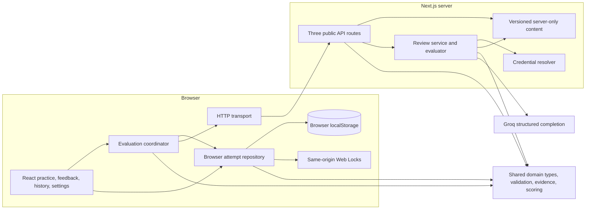

# LLD Practice — implemented high-level design

This document describes the application in this repository, rather than proposed infrastructure. The companion [low-level design](../lld/README.md) describes its classes, state transitions, and sequences. [Verification](../verification.md) is the authoritative record of executed checks and outstanding acceptance work; source structure alone is not evidence that every browser or provider scenario passed.

## Product boundary

The workflow follows [the v3 flow](../lldpractice-v3.excalidraw): **Choose problem → Draft → Save frozen submission → Evaluate → Feedback → Revise → History**. Saving and evaluating are separate actions.

There are exactly two problems: Tic-Tac-Toe and Snake and Ladder. Each has ten system-design fundamentals and ten problem-specific OOP/code questions, with executable Java, Python, and C++ variants for the code track. Quick practice contains both MCQ tracks; full practice also contains a guided design worksheet. New attempts use content `3.0.0`; historical `1.0.0` and `2.0.0` packages remain available for saved attempts. An attempt pins its problem, content version, language, and practice mode.

The worksheet records assumptions, requirement handling, classes/interfaces, relationships, normal and failure walkthroughs, and a justified trade-off through a guided studio with requirement cards and Next/Back section controls. The private scratchpad is a canvas-style local aid and is excluded from review input. Each current attempt has ten system-design MCQs and ten problem-specific OOP/code MCQs; MCQ scoring is out of 100. Feedback exposes independently completed components, evidence, finding priorities, and actionable suggestions. Revision creates a new linked draft, copies design, and resets MCQ answers. History supports reopening and comparing related attempts.

Tic-Tac-Toe uses a fixed 3×3 board, X first, atomic move rejection, and terminal win/draw states. Snake and Ladder starts players at zero, requires exact 100, preserves position on overshoot, gives no six bonus, and applies at most one landing transition. These are authored package rules, not simulated game sessions running in the application.

No accounts, login, database, durable job queue, or background grading workers are included. The deliverable is a local application within the existing Next.js/Vercel deployment boundary. Public deployment and assignment submission are separate actions outside this implementation cycle.

## System structure

The shared [domain](../../src/domain/) depends on neither React nor browser storage, HTTP, or Groq. Browser application code coordinates domain operations and persistence. The current coordinator uses the concrete browser repository contract; this is a browser-oriented application layer, not a claim of a fully interchangeable infrastructure adapter architecture.

Server modules validate transport input, look up trusted packages, admit requests, select a request-scoped credential, call the provider, validate the complete response, and calculate marks. Server-only package construction and projection prevent answer keys, explanations, rubric anchors, and reference designs from being included in initial public problem snapshots.

## Ownership and data lifecycle

| Data | Owner and lifetime |
|---|---|
| Draft design and answers | Editable attempt in this browser; 500ms debounced persistence |
| Frozen submission | Submitted attempt; saved before any evaluation request |
| Evaluation runs and review session | Browser attempt; run persisted before dispatch |
| Received scores/reports | Published in memory, then persisted; local save retry does not re-evaluate |
| Content and grading keys | Versioned server-only packages; public projections contain only practice material |
| Learner credential | Memory by default; separate optional remembered-key storage |
| Platform credentials | Server environment only; never public configuration or backups |
| Credential health and admission | Process-local memory; no deployment-wide coordination |

Practice storage uses a versioned envelope with revision, writer identity, save timestamp, and attempts. Preferences and credentials have separate versioned storage keys. Practice backups include attempts and lineage, but exclude credentials and preferences.

Web Locks select one writer per origin in a supported browser. Another tab can read saved work and acquire ownership after the previous owner releases its lock. Revision and writer comparisons additionally detect unexpected storage changes. Conflicts suspend mutation while preserving unsaved data for export. Unsupported storage/locking permits memory-only drafting and export; persistent submission is unavailable there.

Hydration is explicit. Saved pending submissions remain pending until the learner evaluates them. Runs left running after browser loss become interrupted and require an explicit retry. Corrupt practice bytes remain exportable, and confirmed valid backup replacement only removes the recovery state after successful persistence.

## HTTP and evaluation boundary

The public API surface remains exactly:

| Endpoint | Behavior |
|---|---|
| `GET /api/config` | Public model/configuration, available content versions, limits, and platform availability boolean |
| `POST /api/mcq/score` | Validate pinned answers and return deterministic grading plus explanations/reference design |
| `POST /api/design/review` | Initial or final structured review of submitted design evidence |

Successful POST responses carry attempt, snapshot, run, and server request correlation. Error responses contain safe codes/messages and optional retry timing. Responses use `Cache-Control: no-store`. The server checks origin, JSON content type, actual streamed body size, and bounded domain fields. The browser transport rejects redirects and bounds response bodies to 1 MiB.

The review sequence is **validate request → resolve pinned content/configuration → admit request → select credential → call provider → validate output → calculate marks → return correlated result**. MCQ scoring uses the corresponding local answer-key path without provider access.

Ten MCQs are worth five marks each, totaling 50. Design assessment has five anchored criteria—requirements, responsibilities, relationships, behavior, trade-offs—rated by integers from 0 through 4. The server multiplies their sum by 2.5 for a maximum of 50. The full-practice total appears only after both required components succeed; quick practice reports its MCQ component.

The provider is `openai/gpt-oss-120b`, with medium reasoning, strict JSON schema output, an 8,192-token completion budget, and one retry only for provider JSON-schema generation failures. Its input contains trusted requirements, exclusions, rubric anchors, and frozen design evidence; final review additionally receives frozen clarification questions/answers. Scratchpad, MCQ results, previous reports, and reference solutions are excluded.

Initial review can return a report or at most two targeted clarification questions. The learner answers or explicitly skips each question. Those choices are frozen before a final review, which cannot ask a second round. Validation rejects incomplete/refused/truncated output, missing criterion coverage, invalid integer ratings, invented evidence addresses or quotes, unknown requirement references, and invalid priority identities. A schema-valid assessment is still not proof of grading accuracy.

See [review service](../../src/server/review-service.ts), [provider adapter](../../src/server/design-evaluator.ts), [wire schema](../../src/server/review-wire.ts), and [domain evidence validation](../../src/domain/evidence.ts).

## Failure and cancellation behavior

MCQ scoring and design review run independently. Completion order does not decide whether the other component survives. A successful result remains in memory if saving it fails; retrying its local save makes no new HTTP/provider call. A failed snapshot or run save prevents dispatch for that operation.

Attempt, snapshot, run, review session, configuration, and browser generation identify active work. Import, clear, reload, and ownership invalidation abort local requests and reject obsolete callbacks. Confirmed clearing resets practice, preferences, credentials, and memory. Each storage-key removal has its own outcome; partial removal suspends writes and identifies failed keys.

Cancellation stops local waiting and attempts transport cancellation. It does not prove that a remote provider stopped computation or charging. Likewise, a browser crash after a provider call but before saving the response can require an explicit repeat call. There is no durable exactly-once evaluation guarantee.

## Credentials, cost, and process limits

Platform mode selects its phase-specific key, then the shared default, then an eligible fallback:

| Variable | Role |
|---|---|
| `GROQ_REVIEW_API_KEY` | Initial design review |
| `GROQ_FINAL_REVIEW_API_KEY` | Final review after clarification |
| `GROQ_FALLBACK_API_KEY` | Eligible replacement platform credential |
| `GROQ_CALIBRATION_API_KEY` | Explicit calibration runs |
| `GROQ_API_KEY` | Shared default; one configured key is sufficient |

Credential health records rejection and temporary cooldowns without exposing a public key inventory. Provider failure never silently launches a second call. An explicit later retry may select an eligible platform replacement. Learner and platform credential modes never switch automatically. Rate/quota cooldowns prevent cycling platform keys through an organization-level limit; multiple keys do not create additional organization quota.

Admission and credential health are best effort within one server process. Replicas and cold starts do not share these maps. Current admission controls bound concurrency and repeated identities per process; they are neither durable idempotency storage nor deployment-wide abuse protection. Free-tier compatibility is an operating constraint, not a guarantee of unlimited free provider capacity.

The provider deadline is 60 seconds, the browser review deadline 70 seconds, and browser scoring deadline 10 seconds. The review route declares `maxDuration = 75` for the existing hosting boundary. Hosting configuration and provider quotas still determine practical availability.

## Interface structure

[The shared shell](../../src/ui/shell.tsx) and [global stylesheet](../../src/app/globals.css) implement a maximum 1440px shell with a 240px navigation column, flexible central workspace, 220px outline/help panel, and 24px gaps. Typography remains Helvetica with black, white, and yellow.

The left navigation contains Practice, History, Settings, both problems, and the current attempt. The center presents a compact heading and Design/MCQs/Review controls; quick mode omits Design. Authored help occupies the right panel, and parent feedback supports revision. Below 1280px the right panel moves into disclosures; below 1024px the left navigation uses a mobile menu. Smaller screens stack the remaining content.

Accessible focus styles, labels, skip navigation, status/error messages, and native disclosures are implemented. Actual keyboard and responsive acceptance results belong to the verification record, not to this architecture description.

## Trust and verification limits

The browser owns the saved snapshot. A stateless server can validate shape, content versions, answers, and evidence consistency; it cannot cryptographically prove that a client actually froze those bytes earlier or that client-supplied clarification history came from a previous invocation. There are no accounts, signed submissions, or server-held session history. This application is a practice tool, not a tamper-resistant examination service.

Content execution, disclosure tests, domain/persistence/coordinator/API tests, browser workflows, and build checks have separate gates in [verification](../verification.md). [Calibration](../calibration.md) defines fixtures, repeat runs, answered/skipped clarification, and comparison to independent human ratings. Without configured provider access and independent human review, live grading accuracy, repeatability, and agreement targets remain unverified. Mocked provider results do not substitute for that evidence.
