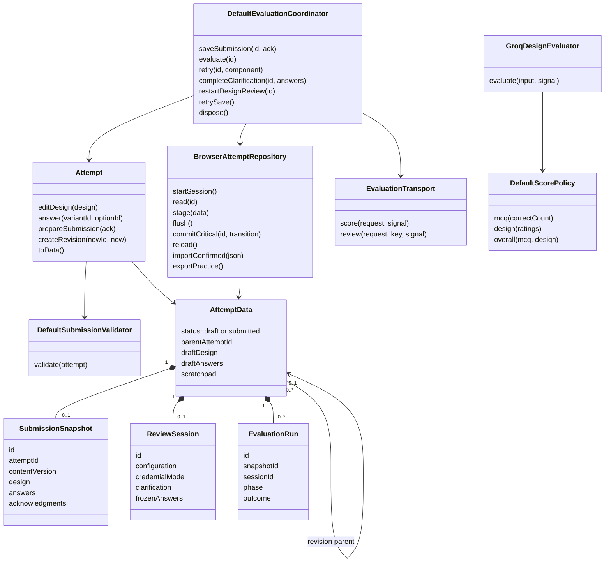
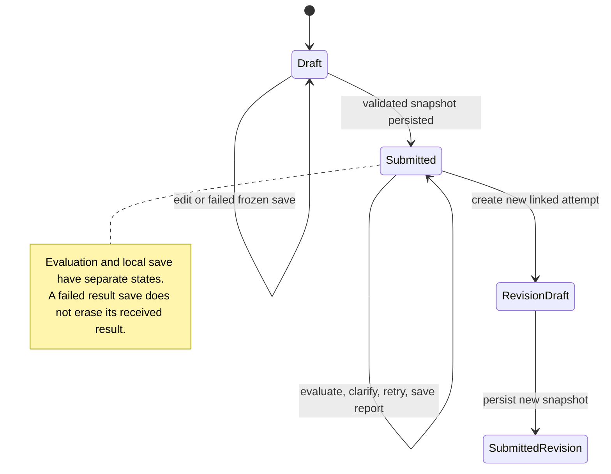
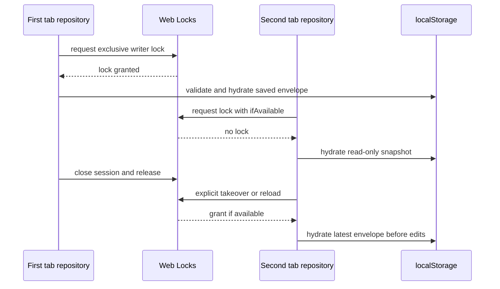
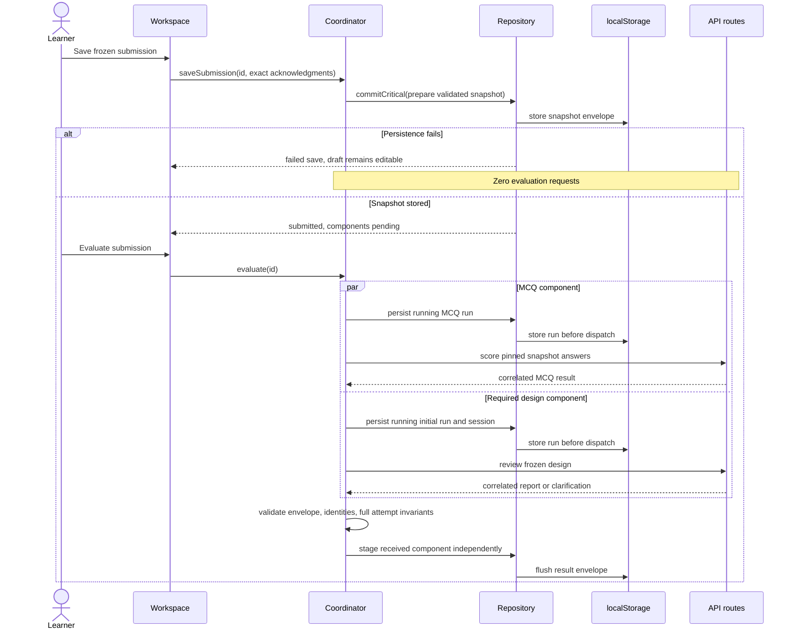
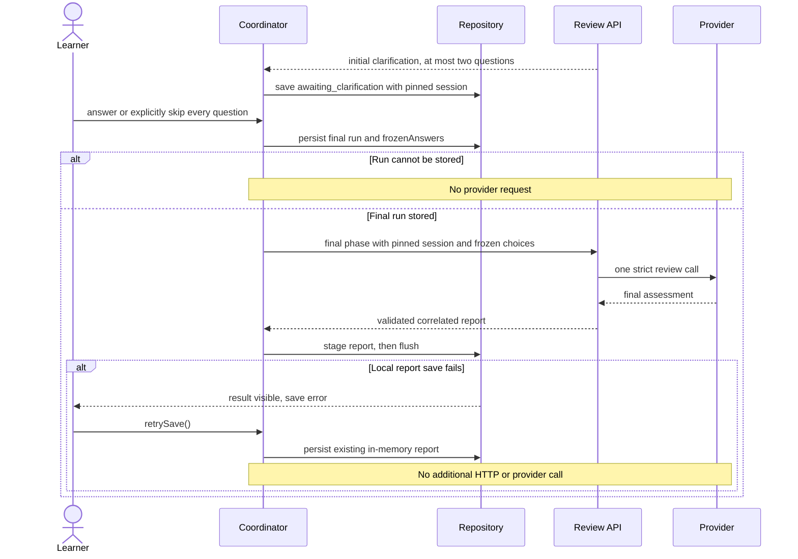
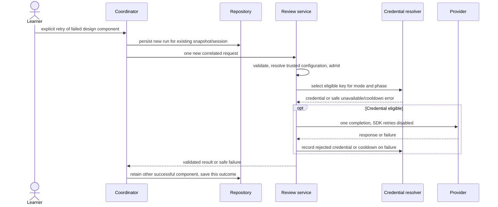
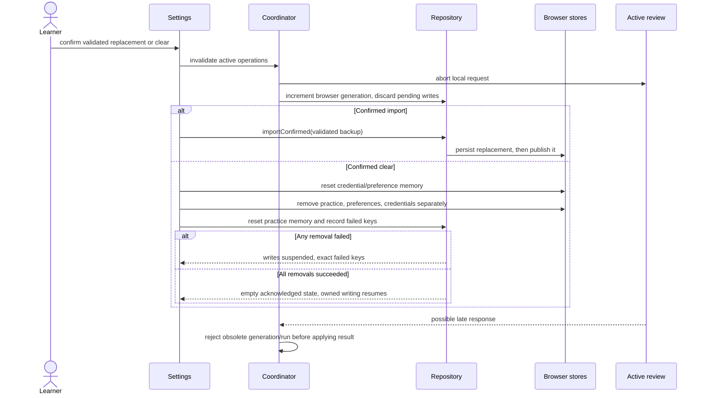

# LLD Practice — implemented low-level design

This document maps actual code responsibilities and transitions. It complements the [high-level design](../hld/README.md) and the [v3 product flow](../lldpractice-v3.excalidraw). Run commands and current validation scope are recorded in the [README](../../README.md); remaining live evaluation gates are recorded in [calibration](../calibration.md).

## Code map and dependencies

| Module | Responsibility and principal source |
|---|---|
| Domain types and schemas | Attempt, snapshot, run, session, evidence, request, content, and backup contracts; [types](../../src/domain/types.ts), [schemas](../../src/domain/schemas.ts) |
| `Attempt` | Draft mutation, submission preparation, immutable snapshot, revision lineage; [attempt.ts](../../src/domain/attempt.ts) |
| `DefaultSubmissionValidator` | Structural/reference checks and exact omission acknowledgments; [attempt.ts](../../src/domain/attempt.ts) |
| `DefaultScorePolicy` | Deterministic MCQ/design arithmetic and conditional combined total; [score-policy.ts](../../src/domain/score-policy.ts) |
| Evidence functions | Resolve typed addresses against frozen design/clarification and verify quotes; [evidence.ts](../../src/domain/evidence.ts) |
| `BrowserAttemptRepository` | Manual hydration, writer ownership, staged/critical writes, conflicts, recovery, import/export; [repository.ts](../../src/persistence/repository.ts) |
| Preference/credential stores | Separate versioned persistence and opt-in key remembering; [stores.ts](../../src/persistence/stores.ts) |
| `clearLocalData` | Invalidate active work, reset stores, remove individual keys, suspend after partial failure; [data-control.ts](../../src/persistence/data-control.ts) |
| `DefaultEvaluationCoordinator` | Frozen save, independent components, run ordering, clarification, retries, cancellation, response correlation; [coordinator.ts](../../src/application/coordinator.ts) |
| HTTP transport | Single no-store same-origin request, bounded response, validated envelopes; [transport.ts](../../src/application/transport.ts) |
| Versioned content | Public projections, v2 packages, archived v1, answer-key evaluator; [internal.ts](../../src/server/content/internal.ts), [archive-v1.ts](../../src/server/content/archive-v1.ts) |
| Review service | Trusted content/configuration validation, admission, credential selection; [review-service.ts](../../src/server/review-service.ts) |
| `GroqDesignEvaluator` | Trusted prompt, one provider invocation, output validation, server-calculated report; [design-evaluator.ts](../../src/server/design-evaluator.ts) |
| `CredentialResolver` / `AdmissionControl` | Request-scoped key selection and process-local health/admission; [credentials.ts](../../src/server/credentials.ts), [http.ts](../../src/server/http.ts) |
| UI runtime and screens | Compose services and render controls/statuses; [provider](../../src/ui/provider.tsx), [workspace](../../src/ui/workspace.tsx), [feedback](../../src/ui/feedback.tsx) |

Domain code uses TypeScript contracts and schema validation without importing React, browser storage, HTTP, or Groq. Infrastructure depends on these contracts. The application coordinator currently accepts `BrowserAttemptRepository` directly, so its persistence dependency is browser-specific; the domain itself remains independent.

The diagram names concrete classes and stored records; it does not introduce additional runtime entities or a database schema.

## Attempt and evaluation invariants

`AttemptData.status` has only `draft` and `submitted`. A draft contains editable design/answers and no snapshot, session, or runs. A submitted attempt contains a snapshot and clears redundant draft fields. Domain mutation methods reject submitted attempts. Submission preparation deep-freezes a cloned, validated snapshot; later revision creates a different attempt ID.

Revision copies pinned content, structured design object IDs, and scratchpad; it resets every MCQ selection and all evaluation state. Parent IDs must refer to submitted attempts and lineage must be acyclic. This preserves comparison against the original evidence and package instead of quietly reinterpreting an old attempt under current content.

Saving and evaluation are orthogonal:

| Concern | States |
|---|---|
| Attempt | `draft`, `submitted` |
| Repository access | `unhydrated`, `writable`, `readonly`, `unsupported`, `corrupt` |
| Repository save | `idle`, `dirty`, `saving`, `saved`, `error`, `conflict` |
| MCQ component | `pending`, `running`, `succeeded`, `failed`, `interrupted` |
| Design component | Same applicable states plus `not_required`, `awaiting_clarification` |
| Run outcome | `running`, `succeeded`, `awaiting_clarification`, `failed`, `interrupted` |

At most one running run exists per component. Runs must reference the active snapshot; the current component outcome must match its run. Current design runs also match their session, credential mode, and configuration. A report must cover exactly five criteria and preserve validated arithmetic. Combined marks are absent until MCQ and required design both succeed.

`DefaultSubmissionValidator` detects unknown questions/options, invalid class/method/relationship references, incomplete sections, and missing requirement handling. Submission acknowledgments must exactly match current omissions. Server review rechecks omission completeness against the trusted versioned requirements rather than relying solely on the submitted mapping list.

## Repository write and hydration rules

`practiceStore` is a vanilla Zustand store with manual hydration; its custom persistence bridge unwraps a validated storage envelope into `PracticeData`. `repositoryStore` exposes the same data plus access/save status. A nonempty reload regression checks that `read()` and the observable store agree.

A storage envelope contains `schemaVersion: 1`, disk revision, writer ID, saved timestamp, and attempts. The repository keeps disk revision separate from logical dirty/saved revisions. Draft `stage()` updates memory immediately and schedules a 500ms debounce. `flush()` serializes pending persistence through one promise queue.

`commitCritical()` captures generation before waiting, flushes prior work, derives its candidate from current data, and stores before publishing. Its candidate consumes an older pending debounce record so that a later autosave cannot overwrite the transition. Failed critical persistence leaves the previously published draft editable. Successful hydration resets the acknowledged write queue, permitting immediate Save/Evaluate without another edit.

Before each persistent write, the repository compares the on-disk writer/revision with its acknowledged envelope. Conflict suspends mutation and preserves unsaved work for export. Successful results use stage-then-flush so that a disk failure cannot erase a result already received; retrying that save contains no evaluation action.

Hydration acquires a Web Lock where supported. A session epoch rejects late acquisition callbacks after closure. Read-only reload cannot grant ownership without acquiring the lock. On reload, only running evaluations normalize to interrupted; intentional pending submissions remain available for their first evaluation. Corrupt bytes are preserved separately for recovery download. A confirmed valid backup may replace owned corrupt storage, but its successful write must precede clearing recovery state.

Web Locks cover cooperating tabs of one origin in one browser. They do not coordinate separate browsers, server replicas, or external writers. Unsupported environments permit memory-only drafting/export, not a falsely acknowledged persistent submission.

## Frozen save and first evaluation

`submit()` remains a compatibility wrapper around save then evaluate. Each component has a generation-qualified action guard. A failed run save sends no request for that component. Final result application reads the latest attempt, so either response order preserves the other component.

## Clarification, component retry, and local save retry

Clarification answers must match the question IDs exactly and are frozen once. The final phase cannot request more questions. A failed/interrupted final run retries the same frozen choices and session. Changing credential mode or configuration requires a new review session rather than silently changing a pinned one.

Retry targets only the chosen failed/interrupted component. A provider failure does not recursively call the provider or select another key within that invocation. Platform fallback can become eligible on a later explicit request. Local run/session correlation is not durable provider deduplication.

## Import or clear during active review

Import validates the backup before replacement. Backup format/version, IDs, lineage, snapshots, run states, reports, and evidence must satisfy domain schemas. Clear does not report success if only some keys were removed. A successful repeated clear restores persistence; unsaved or deleted old generations cannot recreate the cleared practice envelope.

## Server review and scoring details

The routes in [src/app/api](../../src/app/api/) keep their existing three-endpoint surface. The [HTTP helpers](../../src/server/http.ts) validate origin, media type, streamed byte bounds and body deadlines; errors expose safe fields and request IDs, never raw provider errors. The browser [transport](../../src/application/transport.ts) validates response envelopes and bounds bodies before the coordinator applies domain-level consistency checks.

`review()` resolves a server-only package and exact provider/model/reasoning/prompt/evaluator/rubric configuration, checks submitted requirement IDs and omissions against trusted requirements, admits the request, selects a credential, and calls `GroqDesignEvaluator`. Admission releases in a `finally` path.

The provider wire schema uses explicit nullable fields suited to strict output. The adapter normalizes these fields into domain evidence addresses, generates application IDs for findings/questions, validates priority references, and rejects refusals, non-stop completion, oversized/truncated/invalid JSON, invalid phase branches, invented quotes, unsupported evidence addresses, or inconsistent assessments. Contradictions require concrete quotes. A strength must resolve to actual submitted evidence. `parseDesignReport` validates the resulting report against the frozen evidence after server score calculation.

MCQ scoring obtains correct options and all option rationales from the pinned private package. It returns 0 or 5 marks per question and a reference approach at the intended feedback boundary. The content and public layout never include those private fields before grading. Tests must inspect both payloads and generated client bundles to verify this boundary.

## Operational limits and evidence

Provider invocation uses `openai/gpt-oss-120b`, medium reasoning, 8,192 completion tokens, strict JSON schema, a 60-second provider deadline, and one retry only for provider JSON-schema generation failures. The coordinator defaults to 70 seconds for review and 10 seconds for scoring; the review route declares 75 seconds. Timeout/abort handling bounds local waiting but cannot certify remote cancellation.

`CredentialResolver` tracks hashed credential identity, rejection, and cooldown in process memory. Initial/final/calibration role keys fall back to the shared key and eligible fallback. Learner keys remain request-scoped, and mode never changes automatically. Platform rate/quota cooldowns prevent using another platform key to evade the same organization limit.

Admission maps and credential health do not survive process replacement or synchronize across replicas. Browser UUIDs provide correlation, not authentication or durable idempotency. The stateless server cannot prove that the client previously froze a design or previously received a claimed clarification. No cryptographic submission attestation, durable job, or cross-replica exactly-once guarantee exists.

The [README](../../README.md) records the validation commands, while [calibration](../calibration.md) owns fixture and live grading records. Missing provider credentials or independent human review leave grading accuracy/agreement and repeatability targets unverified. No source diagram or mocked test is presented as a live calibration result.

Current evaluator/prompt IDs are `design-v2` / `review-v2`. A saved session pinned to an unavailable older configuration must explicitly restart; its frozen 1.0.0 or 2.0.0 problem package remains available. Admission currently allows four concurrent / 20 per-minute reviews and 32 concurrent / 120 per-minute scoring calls within each process. A failed replacement import normalizes cancelled original runs to interrupted, preserving completed components and a local-save recovery path.
